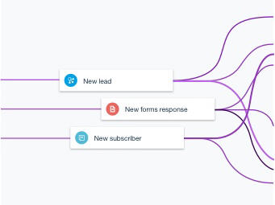

---

copyright:
  years: 2017
lastupdated: "2018-07-19"

---

{:new_window: target="_blank"}
{:shortdesc: .shortdesc}
{:screen: .screen}
{:pre: .pre}
{:codeblock: .codeblock}
{:tip: .tip} 
{:download: .download}

# IBM App Connect
{: #appconnect}

{{site.data.keyword.appconservicefull}} is an integration solution that connects the applications that you use every day and automates tedious tasks.

{{site.data.keyword.appconserviceshort}} connects your applications in minutes - automating updates, notifications, and events, and keeping your data in sync between multiple applications. You can use it to connect applications in the cloud or local (on-premises) applications.  

There are two types of resource that you can run in {{site.data.keyword.appconserviceshort}} to connect your apps, depending on your business needs: integration servers and flows.

To run your IBM Integration Bus or App Connect Enterprise solutions in {{site.data.keyword.appconserviceshort}}, you upload an integration solution in a BAR file, then run it in an integration server in {{site.data.keyword.appconserviceshort}}.

You create flows  in {{site.data.keyword.appconserviceshort}} to connect your applications so that something that happens in one application makes something else happen in another application. You can create event-driven flows and flows for APIs.

As the name suggests, you start to build your event-driven flow by choosing an event. The event is the trigger in your first application that makes your flow start working.

Then you choose an action. The action is the task that you want your flow to complete in another application. 

You can use the {{site.data.keyword.appconserviceshort}} dashboard to monitor your flows and integration servers to see how much work they're doing for you. Start and stop them, and change them when you need to.

That's all there is to it. Start connecting your applications, and let {{site.data.keyword.appconserviceshort}} work for you.

