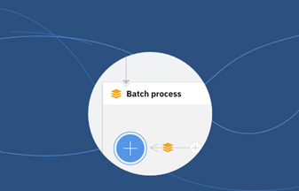
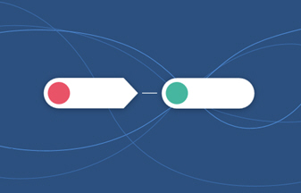

---

copyright:
  years: 2017
lastupdated: "2019-02-06"

---

{:new_window: target="_blank"}
{:shortdesc: .shortdesc}
{:screen: .screen}
{:pre: .pre}
{:codeblock: .codeblock}
{:tip: .tip} 
{:download: .download}

# IBM App Connect
{: #appconnect}

{{site.data.keyword.appconservicefull}} ist eine Integrationslösung, die die Anwendungen verbindet, die Sie täglich verwenden, und langwierige Tasks automatisiert.

{{site.data.keyword.appconserviceshort}} verbindet Ihre Anwendungen in Minutenschnelle und automatisiert dabei Aktualisierungen, Benachrichtigungen und Ereignisse und hält so Ihre Daten zwischen mehreren Anwendungen synchron. Sie können das Produkt verwenden, um Anwendungen in der Cloud oder Vor-Ort (lokale Anwendungen) zu verbinden.   

Es gibt zwei Typen von Ressourcen, die Sie in {{site.data.keyword.appconserviceshort}} ausführen können, um Ihre Apps zu verbinden. Dies hängt von Ihren Geschäftsanforderungen bezüglich Integrationsservern und Abläufen ab.  

Wenn Sie Ihre IBM Integration Bus- oder App Connect Enterprise-Lösungen in {{site.data.keyword.appconserviceshort}} ausführen möchten, laden Sie eine Integrationslösung in eine BAR-Datei hoch, und führen Sie sie dann in einem Integrationsserver in {{site.data.keyword.appconserviceshort}} aus.

Sie erstellen Abläufe in {{site.data.keyword.appconserviceshort}}, um Ihre Anwendungen so zu verbinden, dass ein Ereignis in einer Anwendung ebenfalls in einer anderen Anwendung erfolgt. Erstellen Sie Abläufe, die Daten zwischen Anwendungen weiterleiten, entweder als einzelne Stapelkopie oder durch fortlaufende Synchronisation.

Sie können ereignisgesteuerte Abläufe und Abläufe für APIs erstellen. 

Wie der Name schon vermuten lässt, beginnen Sie mit der Erstellung eines ereignisgesteuerten Ablaufs damit, dass Sie ein Ereignis auswählen. Das Ereignis in der ersten Anwendung ist der Auslöser, der den Start des Ablaufs ermöglicht. Anschließend wählen Sie eine Aktion aus. Die Aktion ist die Task, die der Ablauf in einer anderen Anwendung ausführen soll. 

Sie können das {{site.data.keyword.appconserviceshort}}-Dashboard verwenden, um Ihre Abläufe und Integrationsserver zu überwachen und so den Umfang der für Sie erledigten Arbeit festzustellen. Sie können die Server starten oder stoppen und bei Bedarf Änderungen vornehmen. 

Damit wissen Sie auch schon alles, was zu diesem Thema zu sagen ist. Beginnen Sie, Ihre Anwendungen zu verbinden, und lassen Sie {{site.data.keyword.appconserviceshort}} für sich arbeiten.

