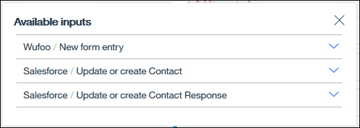

---

copyright:
  years: 2017
lastupdated: "2019-02-20"

---

{:new_window: target="_blank"}
{:shortdesc: .shortdesc}
{:screen: .screen}
{:pre: .pre}
{:table: .aria-labeledby="caption"}
{:codeblock: .codeblock}
{:tip: .tip} 
{:download: .download}

# IBM App Connect - Konzepte
{: #concepts}

{{site.data.keyword.appconservicefull}} ist ein geschäftsfreundliches Tool, mit dem Sie Ihre Cloud-basierten oder lokalen Anwendungen integrieren können, um langwierige und sich wiederholende Aufgaben zu automatisieren.

{{site.data.keyword.appconserviceshort}} verbindet Ihre Anwendungen in Minutenschnelle und automatisiert dabei Aktualisierungen, Benachrichtigungen und Ereignisse und hält so Ihre Daten zwischen mehreren Anwendungen synchron. Sie können das Produkt verwenden, um Anwendungen in der Cloud oder Vor-Ort (lokale Anwendungen) zu verbinden.   

Es gibt zwei Typen von Ressourcen, die Sie in {{site.data.keyword.appconserviceshort}} ausführen können, um Ihre Apps zu verbinden. Dies hängt von Ihren Geschäftsanforderungen bezüglich Integrationsservern und Abläufen ab.  Wenn Sie Ihre IBM Integration Bus- oder App Connect Enterprise-Lösungen in {{site.data.keyword.appconserviceshort}} ausführen möchten, laden Sie eine Integrationslösung in eine BAR-Datei hoch, und führen Sie sie dann in einem Integrationsserver in {{site.data.keyword.appconserviceshort}} aus.  Sie erstellen Abläufe in {{site.data.keyword.appconserviceshort}}, um Ihre Anwendungen so zu verbinden, dass ein Ereignis in einer Anwendung ebenfalls in einer anderen Anwendung erfolgt.  Sie können ereignisgesteuerte Abläufe und Abläufe für APIs erstellen. 

Sie können das {{site.data.keyword.appconserviceshort}}-Dashboard verwenden, um Ihre Abläufe und Integrationsserver zu überwachen und so den Umfang der für Sie erledigten Arbeit festzustellen. Sie können die Server starten oder stoppen und bei Bedarf Änderungen vornehmen. 

Im Folgenden werden die Funktionen und die Terminologie von {{site.data.keyword.appconserviceshort}} erläutert:

-   [Abläufe](#flows)
-   [Anwendungen](#apps)
-   [Aktionen](#actions)
-   [Datenzuordnung](#transforms)
-   [BAR-Dateien und Integrationsserver](#barfiles)

## Abläufe
{: #flows}

Es gibt zwei Typen von Abläufen, die Sie in {{site.data.keyword.appconserviceshort}} erstellen können: Ein ereignisgesteuerter Ablauf und ein Ablauf für eine API.

Bei einem ereignisgesteuerten Ablauf geben Sie ein Ereignis an, das in Ihrer ersten Anwendung (Quellenanwendung) auftreten kann, sowie Aktionen, die in einer oder mehreren Zielanwendungen ausgeführt werden sollen. Der Ablauf verbindet das Ereignis mit den Aktionen, sodass bei jedem Auftreten des Ereignisses in der Quellenanwendung automatisch die Aktion in den Zielanwendungen ausgelöst wird. Jede erfolgreich ausgeführte Aktion wird für Ihr monatliches Kontingent berechnet. Wenn Sie einen Ablauf erstellen, wählen Sie also Ihre Anwendungen und entsprechende Aktionen aus. Dann ordnen Sie die Daten zu, die zwischen Ihren Anwendungen übertragen werden sollen. 

Sie können beispielsweise einen Ablauf so erstellen, dass bei jeder Registrierung eines neuen Teilnehmers bei Eventbrite (das Ereignis), {{site.data.keyword.appconserviceshort}} automatisch Details des Teilnehmers bei Salesforce abruft und eine neue Task in Asana (die Aktionen) erstellt. 

Weitere Informationen finden Sie im Abschnitt zum Erstellen eines ereignisgesteuerten Ablaufs [Creating an event-driven flow](https://developer.ibm.com/integration/docs/app-connect/tutorials-for-ibm-app-connect/creating-event-driven-flow/).

Ein Ablauf für eine API enthält eine Anforderung, eine oder mehrere Aktionen für die Zielanwendung und eine Antwort. Die Anforderung verwendet ein Modell, das Sie definieren, um die Erstellung, den Austausch oder das Abrufen von Datenobjekten in Ihren Anwendungen anzufordern. Wenn die Anforderung übergeben wird, führt jede Zielanwendung ihre Aktion aus und der Ablauf gibt eine Antwort zurück, die entweder bestätigt, dass die Aktionen erfolgreich waren, oder die angeforderten Daten zurückgibt.

Weitere Informationen finden Sie im Abschnitt zum Erstellen von Abläufen für eine API [Creating flows for an API](https://developer.ibm.com/integration/docs/app-connect/tutorials-for-ibm-app-connect/creating-flows-api/).

Neben dem Hinzufügen von Anwendungen zu Ihren Abläufen können Sie auch Knoten auf der Registerkarte **Logik** hinzufügen, mit deren Hilfe Sie die Verarbeitung von Daten konfigurieren können. Verwenden Sie zum Beispiel den IF-Knoten, um eine bedingte Verarbeitung hinzuzufügen, die abhängig von den empfangenen Daten unterschiedliche Aktionen ausführt (siehe den Abschnitt über das Hinzufügen von Bedingungslogik zu einem Ablauf [Adding conditional logic to a flow ](https://developer.ibm.com/integration/docs/app-connect/tutorials-for-ibm-app-connect/adding-conditional-logic-flow/)). Verwenden Sie den FOR EACH-Knoten, wenn Sie eine Aktion für jeden Datensatz ausführen möchten, der von einer Abrufaktion zurückgegeben wird (siehe den Abschnitt über das Abrufen von Elementen aus Ihren Anwendungen [Retrieving items from your applications ](https://developer.ibm.com/integration/docs/app-connect/tutorials-for-ibm-app-connect/using-ibm-app-connect-retrieve-items-applications/)).

Wenn Sie Entwickler für IBM Integration Bus oder App Connect Enterprise sind, können Sie auch komplexe Integrationslösungen erstellen, indem Sie Nachrichtenflüsse im Integration Toolkit entwickeln und diese in BAR-Dateien paketieren. 

Ihre Abläufe und Integrationsserver werden im App Connect-Dashboard durch Kacheln dargestellt. Die Kacheln zeigen Übersichtsinformationen zum Ablauf oder zum Integrationsserver an. Dazu gehören zum Beispiel Informationen darüber, ob ein Ablauf aktiv ist oder gestoppt wurde und ob die Ausführung erfolgreich war oder einen Fehler verursacht hat. Sie können auf die Schrittmarkierung und das Ausrufezeichensymbol klicken, um anzuzeigen, wann der letzte Ablauf erfolgreich ausgeführt wurde oder welche Fehler aufgetreten sind. Klicken Sie auf die drei Punkte , um ein Menü zu öffnen, mit dem Sie Ihre Ressourcen starten, stoppen, bearbeiten oder löschen können. Abläufe wurde gestoppt, bevor Sie sie bearbeiten konnten. 

## Anwendungen
{: #apps}

Beim Erstellen ereignisgesteuerter Abläufe oder von Abläufen für APIs sind _Anwendungen_ cloudbasierte Softwareanwendungen, die Sie verbinden. Sie können eine Liste der Anwendungen anzeigen, die Sie auf der Seite **Anwendungen** mit {{site.data.keyword.appconserviceshort}} verbinden können. Klicken Sie auf eine Anwendung, um mehr darüber zu erfahren, um zu sehen, welche Ereignisse und Aktionen unterstützt werden, und um eine Verbindung zu Ihrem eigenen Konto herzustellen. Sie können über mehrere Konten verfügen, die mit jeder Anwendung verbunden sind, und über die Seite 'Anwendungen' zwischen diesen Konten umschalten. Nachdem Sie eine Verbindung zu Ihrem Konto hergestellt haben, können Sie Ihr Konto auch auf dieser Seite aktualisieren oder entfernen.

Sie müssen keine Verbindung zu Ihren Anwendungen auf der Seite 'Anwendungen' herstellen. Sie können die Verbindung auch im Ablaufeditor herstellen, wenn Sie die Anwendungen zu Ihrem Ablauf hinzufügen. Für viele Anwendungen ist nur ein Benutzername und ein Kennwort erforderlich, aber einige benötigen weitere Informationen. Wie Sie diese weiteren Informationen finden, erfahren Sie im Handbuch [How-to guides for apps ](https://developer.ibm.com/integration/docs/app-connect/how-to-guides-for-apps/).

Wenn Sie {{site.data.keyword.appconservicefull}} für die Ausführung von Integration Bus- oder App Connect Enterprise-Lösungen in der Cloud verwenden, ist eine _Anwendung_ der Container, in dem die Nachrichtenflüsse, Bibliotheken und anderen Ressourcen gespeichert sind, die für Ihre Lösung erforderlich sind. 

## Aktionen
{: #actions}

Sie können mehrere Typen von Aktionen zu Ihren Abläufen hinzufügen. Allgemeine Aktionen sind Erstellen, Abrufen und Aktualisieren oder Erstellen. Einige Anwendungen verfügen über spezifische Aktionen. Die Anwendung Equals 3 Lucy zum Beispiel verfügt über die Aktion "Frag-Lucy" und die Anwendung Watson Personality Insights verfügt über die Aktion "Analyze personality" zur Durchführung eines Persönlichkeitstests. Sie können eine Liste der Aktionen anzeigen, die für Anwendungen in {{site.data.keyword.appconserviceshort}} unterstützt werden, indem Sie den Aktionstyp oben auf der Seite 'Anwendungen' im Suchfeld eingeben. 

**Erstellen**

Wie der Name bereits vermuten lässt, erstellt die Erstellungsaktion ein Objekt oder einen Datensatz in einer Anwendung. Wenn sich zum Beispiel jemand zu Ihrem Ereignis meldet oder ein ausgefülltes Formular übermittelt, möchten Sie vermutlich einen Datensatz für diese Person in Ihrem CRM-System oder Ihrer Marketinganwendung erstellen. Oder wenn jemand ein Ticket an Ihre Help-Desk-Anwendung sendet, möchten Sie vermutlich eine E-Mail oder eine Ad-hoc-Nachricht erstellen, um sicherzustellen, dass jemand sich sogleich um die Angelegenheit kümmert. Wenn die Möglichkeit besteht, dass das Objekt, das Sie erstellen wollen, bereits vorhanden ist, können Sie stattdessen die Aktion zum *Aktualisieren oder Erstellen* verwenden. 

Für einige Anwendungen müssen Sie zusätzliche Informationen bereitstellen, wenn Sie eine Aktion für einen Ablauf erstellen, um anzugeben, wo das Objekt erstellt werden soll. Wenn Sie beispielsweise eine Projektmanagementanwendung wie Asana oder Trello verwenden, wenn Sie eine Task oder eine Karte erstellen, müssen Sie das Projekt oder das Board angeben, in bzw. auf dem die Erstellung erfolgen soll. 

**Aktualisieren oder Erstellen**

Die Aktion zum Aktualisieren oder Erstellen ändert einen vorhanden Datensatz in Ihrer Zielanwendung. Wenn noch kein Datensatz vorhanden ist, wird ein Datensatz erstellt. Diese Aktion wird auch als Upsert (UPdate INSERT) bezeichnet. 

Angenommen jemand hat ein Wufoo-Formular mit einer Adressänderung übermittelt. Wenn sich der Kontakt bereits in Ihrem CRM-System befindet, möchten Sie die Adresse aktualisieren. Wenn dies jedoch nicht der Fall ist, möchten Sie sie hinzufügen. Wenn Sie eine Aktion zum Aktualisieren von Daten in einer Ihrer Anwendungen auswählen, können Sie, wie bei der Abrufaktion, eine oder mehrere Bedingungen hinzufügen, um sicherzustellen, dass Sie die richtigen Informationen aktualisieren.

Wenn es mehr als einen Datensatz in Ihrem Zielsystem gibt, der mit Ihren Kriterien übereinstimmt, wird im Dashboard ein Fehler für den Ablauf angezeigt und der Ablauf veranlasst weder eine Aktualisierung noch eine Erstellung von Datensätzen. Ein Beispiel: Sie verfügen über mehrere Kontakte mit demselben Vor- und Nachnamen. Sie können nun versuchen, einen Kontakt mit eindeutigen Daten wie zum Beispiel der E-Mail-Adresse zuzuordnen. 

Die Statuscodes, die Sie wahrscheinlich als Antwort auf eine Aktion zum Aktualisieren oder Erstellen sehen werden, sind:

-   200: A record was updated
-   201: A record was created

Sie können diese Antwortcodes später in Ihrem Ablauf verwenden. Vielleicht möchten Sie verschiedene Aktionen ausführen, je nachdem, ob ein Datensatz aktualisiert oder erstellt wurde. Ein Beispiel für die Definition von Aktionen auf Grundlage von Antwortcodes finden Sie im Lernprogramm [Creating an event-driven flow that updates or creates a contact in Salesforce and updates Asana whenever you receive a form in Wufoo](https://developer.ibm.com/integration/docs/app-connect/tutorials-for-ibm-app-connect/creating-event-driven-flow-updates-creates-contact-salesforce-updates-asana-whenever-receive-form-wufoo/).

**Abrufen**

Die Abrufaktion ruft Informationen von einer Anwendung ab, sodass Sie diese in einer anderen Anwendung verwenden können. 

Wenn Sie eine Aktion zu Ihrem Ablauf hinzufügen, um Objekte abzurufen, können Sie eine oder mehrere Bedingungen definieren, um sicherzustellen, dass Sie die richtigen Elemente abrufen. Wenn Sie einfach alle Elemente eines bestimmten Typs abrufen möchten, können Sie die Bedingung löschen. Sie können ferner definieren, wie viele Elemente Sie abrufen möchten und was geschehen soll, wenn {{site.data.keyword.appconserviceshort}} mehr oder weniger Elemente als angegeben findet. 

Sie können die abgerufenen Elemente auf zwei Arten bearbeiten: 

-   Sie können einen "FOR EACH"-Knoten nach jeder Abrufaktion einfügen, um eine Aktion für jedes abgerufene Element durchzuführen. 
-   Sie können eine andere Aktion nach jeder Abrufaktion hinzufügen, um die Liste der abgerufenen Elemente zu verarbeiten. Dies ist unabhängig von der Anzahl der zurückgegebenen Elemente eine einzelne Aktion – so wie beispielsweise das Erstellen einer E-Mail, die alle abgerufenen Elemente auflistet. 

Sie können auch entscheiden, welche Aktion auf Grundlage des Statuscodes, den Sie in der Antwort auf die Abrufaktion erhalten, erfolgen soll. Sie können einen “IF”-Knoten verwenden, um unterschiedliche Aktionen für verschiedene Statuscodes auszuführen. Die Statuscodes, die wahrscheinlich in der Antwort auf Ihre Abrufaktion angezeigt werden, sind: 

-   204: No records were found
-   200: All records in the application match the condition
-   206: The specified maximum number of records were retrieved, but more matching records exist in the application

Weitere Informationen finden Sie im Abschnitt über das Abrufen von Elementen aus Ihren Anwendungen [Retrieving items from your applications](https://developer.ibm.com/integration/docs/app-connect/tutorials-for-ibm-app-connect/using-ibm-app-connect-retrieve-items-applications/).

## Datenzuordnung
{: #transforms}

Wenn Sie einen Ablauf erstellt, Ihre Anwendungen hinzugefügt und die entsprechenden Aktionen ausgewählt haben, müssen Sie angeben, welche Informationen Sie zwischen Ihren Anwendungen übertragen möchten. Im Ablaufeditor sehen Sie eine Liste verfügbarer Felder für die Anwendung, wenn Sie eine Aktion zum Ablauf hinzufügen. Sie können diese Felder mit Daten aus Ihrer Quellenanwendung oder aus vorherigen Aktionen im Ablauf füllen. 

Einige Felder sind obligatorisch und mit einem Stern markiert. Wenn Sie zum Beispiel eine Kundenkontaktadresse in Salesforce erstellen, müssen Sie einen Nachnamen angeben: 

Wenn Sie in eines dieser Felder klicken, sehen Sie eine Reihe von Symbolen: **Referenz einfügen**  und **Funktion anwenden** . Wenn Sie auf  **Referenz einfügen** klicken, werden die verfügbaren Daten angezeigt, die Sie aus den vorhergehenden Anwendungen im Ablauf in dieses Feld einfügen können. Das folgende Beispiel zeigt, dass Sie Felder von einer Wufoo-Quellenanwendung oder von einer vorherigen Salesforce-Aktion im Ablauf auswählen können. Sie können auch den Statuscode aus der Salesforce-Aktualisierung oder der Aktionserstellung verwenden. 

Im folgenden Beispiel wird der Ablauf von einem neuen ausgefüllten Formular ausgelöst, das in Wufoo empfangen wurde. Sie möchten in Salesforce einen Kontakt für die Person erstellen, die das Formular übermittelt hat. Wenn Sie die Salesforce-Aktion "Kontakt erstellen" zum Ablauf hinzufügen, werden die Details des Kontakts aus dem Wufoo-Formular kopiert. Hier können wir sehen, dass für den Nachnamen des Salesforce-Kontakts der Nachname des Absenders des Wufoo-Formulars ausgewählt wurde. Anhand der Farbe können Sie sehen, dass das zugeordnete Feld von Wufoo stammt: 

Im folgenden Beispiel wurde die Slack-Aktion "Nachricht erstellen" nach der Salesforce-Aktion "Kontakt aktualisieren oder erstellen" zum Ablauf hinzugefügt. Ziel ist es, eine Nachricht in Slack einzustellen, die besagt, welcher Antwortcode für die Salesforce-Aktion empfangen wurde. 

Sie sehen, dass im Feld **Text** der Slack-Aktion 'Nachricht erstellen' eine Nachricht eingegeben wurde, die dann im Statuscode für die Salesforce-Aktion "Kontakt aktualisieren oder erstellen" zugeordnet wurde. 

Es folgt ein weiteres Beispiel für die Zuordnung von Antwortcodes auf eine andere Weise. Es wurde jetzt ein IF-Knoten nach der Salesforce-Aktion "Kontakt aktualisieren oder erstellen" hinzugefügt, da abhängig davon, ob eine vorhandener Salesforce-Kontakt aktualisiert wurde oder ob ein neuer Kontakt erstellt wurde, eine andere Aktion erfolgen soll. In diesem Fall bedeutet der Antwortcode "200", dass der Kontakt aktualisiert wurde. Dieser Zweig des IF-Knotens enthält eine Aktion, die für einen aktualisierten Datensatz spezifisch ist. 

Das Symbol **Funktion anwenden**  zeigt eine Liste der Transformationsfunktionen, die Sie verwenden können, um die Daten anzupassen, die Sie während des Ablaufs übergeben. Diese Funktionen können sehr einfach - wie die Konvertierung eines bestimmten Feldes von Großschreibung zu Kleinschreibung - oder auch komplexer sein - wie das Suchen und Ersetzen bestimmter Muster in den Daten. Es können auch sehr leistungsfähige Funktionen wie das Formulieren von regulären Ausdrücken sein. Sie können entweder die gewünschte Funktion aus der Liste auswählen oder diese selbst eingeben. Die Syntax von Funktionen ist JSONata, eine einfache Abfrage- und Transformationssprache. Weitere Informationen finden Sie unter [http://jsonata.org](http://jsonata.org).

## BAR-Dateien und Integrationsserver
{: #barfiles}

Eine  ist eine komprimierte Datei, zu der Sie in IBM Integration Bus oder App Connect Enterprise bereitstellbare Ressourcen hinzufügen. Wenn Sie eine Integrationslösung in Integration Bus oder App Connect Enterprise entwickeln, paketieren Sie Ihre Nachrichtenabläufe und alle Ressourcen, die diese Nachrichtenabläufe verwenden in eine BAR-Datei und stellen diese auf einem Integrationsserver bereit. Dieser Server kann lokal sein oder sich in {{site.data.keyword.appconserviceshort}} befinden. Sie können Ihre Integration Bus- oder App Connect Enterprise-Lösungen ausführen, ohne eine IT-Infrastruktur anzufordern oder warten zu müssen. Wenn Sie eine BAR-Datei auf App Connect hochladen, wird ein Integrationsserver erstellt, um den Inhalt der BAR-Datei auszuführen. Sie können die Basisauthentifizierung und die sichere Konnektivität zwischen Ihrer cloudbasierten und den lokalen Ressourcen konfigurieren (siehe den Abschnitt zur Ausführung von Integration Bus-Lösungen in App Connect [Running your Integration Bus solutions in App Connect ](https://developer.ibm.com/integration/docs/app-connect/tutorials-for-ibm-app-connect/running-your-ibm-integration-bus-solutions-in-ibm-app-connect-enterprise-beta-plan)).  
