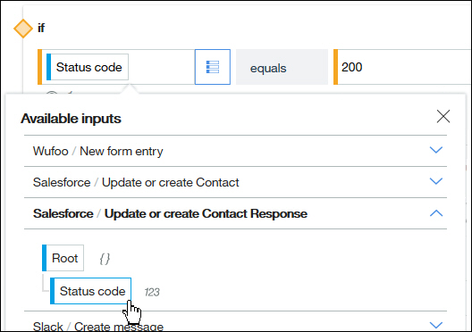

---

copyright:
  years: 2017, 2019
lastupdated: "2019-02-20"

---

{:new_window: target="_blank"}
{:shortdesc: .shortdesc}
{:screen: .screen}
{:pre: .pre}
{:table: .aria-labeledby="caption"}
{:codeblock: .codeblock}
{:tip: .tip} 
{:download: .download}

# Conceptos de IBM App Connect
{: #concepts}

{{site.data.keyword.appconservicefull}} es una herramienta adecuada para los negocios que puede utilizarse para integrar aplicaciones basadas en la nube o locales para automatizar tareas tediosas y repetitivas.

{{site.data.keyword.appconserviceshort}} conecta las aplicaciones en minutos, automatiza las actualizaciones, notificaciones y sucesos, y mantiene sincronizados los datos entre varias aplicaciones. Puede utilizarlo para conectar aplicaciones en la nube y locales.  

Se pueden ejecutar dos tipos de recursos en {{site.data.keyword.appconserviceshort}} para conectar las apps, en función de las necesidades de la empresa: los servidores de integración y los flujos.  Para ejecutar las soluciones de IBM Integration Bus o App Connect Enterprise, se carga una solución de integración en un archivo BAR y, a continuación, se ejecuta en un servidor de integración en {{site.data.keyword.appconserviceshort}}.  Puede crear flujos en {{site.data.keyword.appconserviceshort}} para conectar las aplicaciones de modo que algo que ocurre en una aplicación haga que suceda algo más en otra aplicación.  Puede crear flujos controlados por sucesos y flujos para las API.   

Puede utilizar el panel de control de {{site.data.keyword.appconserviceshort}} para supervisar los flujos y los servidores de integración para ver el trabajo que están realizando para usted. Inícielos, deténgalos y modifíquelos cuando lo necesite.

Aquí explicamos las características y la terminología de {{site.data.keyword.appconserviceshort}} con más detalle:

-   [Flujos](#flows)
-   [Aplicaciones](#apps)
-   [Acciones](#actions)
-   [Correlación de datos](#transforms)
-   [Archivos BAR y servidores de integración](#barfiles)

## Flujos
{: #flows}

Pueden crearse dos tipos de flujos en {{site.data.keyword.appconserviceshort}}: flujo controlado por sucesos y flujo para una API.

En un flujo controlado por sucesos se identifica un suceso que se puede producir en la primera aplicación (la aplicación de origen) y las acciones que se pueden realizar en una o más aplicaciones de destino. El flujo enlaza el suceso con las acciones, de modo que siempre que se produzca el suceso en la aplicación de origen, la acción se desencadenará automáticamente en las aplicaciones de destino. Cada una de las acciones completadas satisfactoriamente se tiene en cuenta con relación a su cuota mensual. Cuando se crea un flujo, se añaden las aplicaciones y se seleccionan las acciones. A continuación, se correlacionan los datos que se desea transferir entre las aplicaciones.

Por ejemplo, puede crear un flujo de modo que siempre que alguien se registre como un nuevo asistente con Eventbrite (el suceso), {{site.data.keyword.appconserviceshort}} recupera automáticamente los detalles del asistente de Salesforce y crea una nueva tarea en Asana (las acciones).

Para obtener más información, consulte [Creación de un flujo controlado por sucesos ](https://developer.ibm.com/integration/docs/app-connect/tutorials-for-ibm-app-connect/creating-event-driven-flow/).

Un flujo para una API contiene una solicitud, una o más acciones de aplicación de destino y una respuesta. La solicitud utiliza un modelo que se define para solicitar la creación, sustitución o recuperación de objetos de datos en las aplicaciones. Cuando se envía la solicitud, cada aplicación de destino realiza su acción.  A continuación, el flujo devuelve una respuesta que confirma que las acciones se han realizado correctamente o devuelve los datos que se han solicitado.

Para obtener más información, consulte [Creación de flujos para una API ](https://developer.ibm.com/integration/docs/app-connect/tutorials-for-ibm-app-connect/creating-flows-api/).

Además de añadir aplicaciones a los flujos, también pueden añadirse nodos desde el separador **Lógica** para configurar cómo se procesan los datos. Por ejemplo, se puede utilizar If (Si) para añadir procesos condicionales, llevando a cabo diferentes acciones según los datos que se reciban (consulte [Añadir lógica condicional a un flujo ](https://developer.ibm.com/integration/docs/app-connect/tutorials-for-ibm-app-connect/adding-conditional-logic-flow/)). Y puede utilizarse el nodo **For each** cuando se desea realizar una acción para cada registro que devuelve una acción de recuperación (consulte [Recuperación de elementos desde las aplicaciones ](https://developer.ibm.com/integration/docs/app-connect/tutorials-for-ibm-app-connect/using-ibm-app-connect-retrieve-items-applications/)).

Si es un desarrollador de IBM Integration Bus o App Connect Enterprise, también puede crear soluciones de integración complejas mediante el desarrollo de flujos de mensajes en Integration Toolkit y empaquetarlas en archivos BAR.

Los flujos y servidores de integración están representados por mosaicos en el panel de control de App Connect. Los mosaicos muestran información de resumen sobre el flujo, la API o el servidor de integración, por ejemplo si un flujo se está ejecutando o se ha detenido, y si ha generado un error. Puede pulsar en los iconos de marca y de signo de exclamación para ver cuándo se ha ejecutado correctamente el flujo de mensajes o qué errores se han producido. Haga clic en los tres puntos  para abrir un menú para iniciar, detener, editar o suprimir los recursos. Es necesario detener los flujos antes de poder editarlos.

## Aplicaciones
{: #apps}

Al crear flujos controlados por sucesos o flujos para las API, las _aplicaciones_ se refiere a las aplicaciones de software basadas en la nube a las que se está conectando.  Puede ver una lista de las aplicaciones a las que se puede conectar {{site.data.keyword.appconserviceshort}} en la página **Aplicaciones**. Haga clic en una aplicación para saber más sobre ella, para ver qué sucesos y acciones están soportados, y para conectarse a su propia cuenta. Puede conectar varias cuentas a cada aplicación y conmutar entre ellas en la página Aplicaciones. Después de conectarse a su cuenta, también puede actualizar o eliminar su cuenta en la página Aplicaciones.

No necesita conectarse a las aplicaciones en la página Aplicaciones; también puede conectarse desde el editor de flujo a medida que añade las aplicaciones a su flujo. Muchas aplicaciones requieren sólo un nombre de usuario y una contraseña, pero algunas necesitan más información. Puede consultar cómo encontrar esta información en las [Guías de procedimiento para apps ](https://developer.ibm.com/integration/docs/app-connect/how-to-guides-for-apps/).

Si utiliza {{site.data.keyword.appconservicefull}} para ejecutar soluciones de Integration Bus o de App Connect Enterprise en la nube, una _aplicación_ es el contenedor que contiene los flujos de mensajes, las bibliotecas y otros recursos que necesita la solución. 

## Acciones
{: #actions}

Puede añadir varios tipos de acción a los flujos. Las acciones comunes son crear, recuperar y actualizar o crear, pero algunas aplicaciones tienen acciones específicas. Por ejemplo, la aplicación Watson Personality Insights tiene una acción llamada "Analizar personalidad". Puede ver una lista de acciones soportadas para aplicaciones en {{site.data.keyword.appconserviceshort}} escribiendo el tipo de acción en el campo de búsqueda de la página Aplicaciones:

**Crear**

Tal y como sugiere el nombre, la acción de crear crea un objeto o un registro en una aplicación. Por ejemplo, si alguien se inscribe a un evento o envía un formulario completado, es posible que desee crear un registro para dicha persona en la aplicación CRM o de marketing. O si alguien abre una incidencia en la aplicación de servicio de asistencia técnica, es posible que desee crear un correo electrónico o un mensaje instantáneo para asegurarse de que alguien se ocupa de ella de forma inmediata. Si existe la posibilidad de que el objeto que desea crear ya exista, puede utilizar una acción de *actualizar o crear* en su lugar.

Es posible que para algunas aplicaciones tenga que proporcionar información adicional cuando añada una acción de crear a un flujo, de manera que el flujo sepa dónde crear el objeto. Por ejemplo, si está utilizando una aplicación de gestión de proyectos como Asana o Trello, cuando cree una tarea o una tarjeta, tiene que especificar el proyecto o el tablero donde desea añadirla.

**Actualizar o crear**

La acción actualizar o crear cambia un registro existente en la aplicación de destino si existe, pero crea el registro si no existe. También se conoce como acción upsert (de "update o insert").

Por ejemplo, supongamos que alguien envía un formulario de Wufoo con un cambio de dirección. Si el contacto ya está en el sistema CRM, desea actualizar la dirección; pero si no está, desea añadirla. Al igual que en la acción de recuperar, cuando selecciona una acción para actualizar los datos en una de las aplicaciones, puede añadir una o más condiciones para asegurarse de que está actualizando la información correcta.

Si hay más de un registro en el sistema de destino que coincide con los criterios, verá un error para el flujo en el panel de control, y el flujo no actualiza ni crea ningún registro. Por ejemplo, tal vez tenga más de un contacto con el mismo nombre y apellidos. Por lo tanto, puede intentar hacer coincidir un contacto utilizando datos exclusivos, como por ejemplo su dirección de correo electrónico.

Es probable que vea los siguientes códigos de estado como respuesta a una acción de actualizar o crear.
-   200 Se ha actualizado un registro
-   201 Se ha creado un registro

Puede utilizar estos códigos de respuesta en un punto posterior del flujo. Tal vez desee realizar diferentes acciones que dependan de si un registro se ha actualizado o se ha creado. Para ver un ejemplo de definición de acciones basándose en códigos de respuesta, consulte la guía de aprendizaje [Creación de un flujo controlado por sucesos que actualiza o crea un contacto en Salesforce y actualiza Asana cuando se recibe un formulario en Wufoo ](https://developer.ibm.com/integration/docs/app-connect/tutorials-for-ibm-app-connect/creating-event-driven-flow-updates-creates-contact-salesforce-updates-asana-whenever-receive-form-wufoo/).

**Recuperar**

La acción de recuperación obtiene información de una aplicación para que pueda utilizarla en otra aplicación.

Cuando añade una acción al flujo para recuperar objetos, puede definir una o más condiciones para asegurarse de que está recuperando los elementos correctos. O bien, si desea recuperar todos los elementos de un tipo determinado, puede suprimir la condición. También puede definir cuántos elementos desea recuperar, y qué ocurre si {{site.data.keyword.appconserviceshort}} encuentra más o menos que ese número.

Puede manejar los elementos recuperados de dos maneras:
-   Puede añadir un nodo "For each" después de la acción de recuperación para llevar a cabo una acción para cada uno de los elementos que se han recuperado.
-   Puede añadir otra acción después de la acción de recuperación para procesar la lista de elementos recuperados. Esta acción es una única acción, sin importar cuántos elementos se hayan recuperado, como por ejemplo crear un mensaje de correo electrónico que contenga la lista de los elementos recuperados.

También puede decidir qué acción se debe realizar en función del código de estado que se obtenga en respuesta a la acción de recuperación. Puede utilizar un nodo "If" para realizar diferentes acciones para los distintos códigos de estado. Es probable que vea los siguientes códigos de estado como respuesta a una acción de recuperación.
-   204 No se han encontrado registros
-   200 Todos los registros de la aplicación coinciden con la condición
-   206 Se ha recuperado el número máximo especificado de registros, pero existen más registros coincidentes en la aplicación

Para obtener más información, consulte [Recuperación de elementos de las aplicaciones ](https://developer.ibm.com/integration/docs/app-connect/tutorials-for-ibm-app-connect/using-ibm-app-connect-retrieve-items-applications/).

## Correlación de datos
{: #transforms}

Después de crear un flujo, añadir las aplicaciones y seleccionar las acciones adecuadas, debe especificar qué información desea transferir entre las aplicaciones. En el editor de flujos, puede ver que cuando añade una acción al flujo, ve una lista de los campos disponibles para esa aplicación.  Puede rellenar estos campos con datos de la aplicación de origen o de acciones anteriores del flujo.

Algunos campos son obligatorios y están marcados con un asterisco. Por ejemplo, cuando está creando un cliente potencial en Salesforce, debe especificar un apellido:

Al pulsar en uno de estos campos, verá dos iconos: **Insertar referencia**  y **Aplicar una función** . Si pulsa **Insertar referencia**, verá los datos disponibles que puede colocar en ese campo procedentes de las aplicaciones anteriores del flujo. El ejemplo siguiente muestra que se pueden elegir campos de la aplicación de origen Wufoo, o de una acción de Salesforce anterior en el flujo. También se puede utilizar el código de estado de la acción de actualizar o crear de Salesforce.

En el ejemplo siguiente, el flujo se desencadena cuando se recibe un formulario completado en Wufoo. Se desea crear un contacto en Salesforce para la persona que ha enviado el formulario. Por lo tanto, al añadir la acción "Crear contacto" de Salesforce al flujo, deberán copiarse los detalles del contacto desde el formulario de Wufoo. Aquí podemos ver que para el apellido del contacto de Salesforce se selecciona el apellido del remitente del formulario en Wufoo. Se puede ver que el campo correlacionado procede de Wufoo por el color:

En el ejemplo siguiente añadimos una acción "Crear mensaje" de Slack al flujo después de una acción "Actualizar o crear contacto" de Salesforce. Se desea enviar un mensaje por Slack indicando el código de respuesta que se recibe de la acción de Salesforce:

Puede ver que en el campo **Texto** para la acción de Slack "Crear mensaje" escribimos un mensaje y, a continuación, se correlacionamos el código de estado de la acción de Salesforce "Actualizar o crear contacto".

A continuación se muestra otro ejemplo de la correlación de códigos de respuesta de una forma distinta. Esta vez añadimos un nodo "If" después de una acción de Salesforce "Actualizar o crear contacto", porque deseamos realizar acciones diferentes que dependen de si se actualiza un contacto de Salesforce existente o si se crea uno nuevo. En este caso, un código de respuesta de "200" significa que el contacto se ha actualizado. Por lo tanto, esta ramificación del nodo "If" contiene una acción específica para un registro actualizado.

El icono **Aplicar una función**  muestra una lista de funciones de transformación que puede utilizar para personalizar los datos que está haciendo pasar a través de su flujo. Estas funciones pueden ser tan simples como convertir un campo determinado a texto en mayúsculas o minúsculas, o un poco más complejas, como encontrar y sustituir patrones específicos en los datos. También pueden ser tan potentes como para formar expresiones regulares. Puede seleccionar la función que desee de la lista, o bien puede escribirla directamente. La sintaxis de las funciones es JSONata, un lenguaje ligero de consulta y transformaciones. Para obtener más información, consulte [http://jsonata.org ](http://jsonata.org).

## Archivos BAR y servidores de integración
{: #barfiles}

Un archivo BAR es un archivo comprimido al que se añaden recursos desplegables en IBM Integration Bus o en App Connect Enterprise.  Cuando desarrolla una solución de integración en Integration Bus o App Connect Enterprise, empaqueta los flujos de mensajes y todos los recursos que estos flujos de mensajes utilizan en un archivo BAR.  A continuación, despliega el archivo BAR en un servidor de integración.  Este servidor puede ser local o estar en {{site.data.keyword.appconserviceshort}}.  Puede ejecutar las soluciones de Integration Bus o App Connect Enterprise en App Connect, sin la necesidad de adquirir y mantener una infraestructura de TI.  Cuando carga un archivo BAR en App Connect, se crea un servidor de integración para ejecutar el contenido del archivo BAR.  Puede configurar la autenticación básica y la conectividad segura entre los recursos basados en la nube y los recursos locales (consulte [Ejecución de las soluciones de Integration Bus en App Connect ](https://developer.ibm.com/integration/docs/app-connect/tutorials-for-ibm-app-connect/running-your-ibm-integration-bus-solutions-in-ibm-app-connect-enterprise-beta-plan)).  
