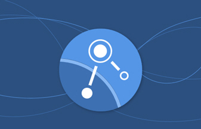

---

copyright:
  years: 2017
lastupdated: "2018-07-19"

---

{:new_window: target="_blank"}
{:shortdesc: .shortdesc}
{:screen: .screen}
{:pre: .pre}
{:codeblock: .codeblock}
{:tip: .tip} 
{:download: .download}

# IBM App Connect
{: #appconnect}

{{site.data.keyword.appconservicefull}} es una solución de integración que conecta las aplicaciones que se utilizan a diario y automatiza las tareas tediosas.

{{site.data.keyword.appconserviceshort}} conecta las aplicaciones en minutos, automatiza las actualizaciones, notificaciones y sucesos, y mantiene sincronizados los datos entre varias aplicaciones. Puede utilizarlo para conectar aplicaciones en la nube y locales.  

Existen dos tipos de recursos que se pueden ejecutar en {{site.data.keyword.appconserviceshort}} para conectar las apps, en función de las necesidades de su empresa: los servidores de integración y los flujos.  

Para ejecutar las soluciones de IBM Integration Bus o App Connect Enterprise en {{site.data.keyword.appconserviceshort}}, se carga una solución de integración en un archivo BAR y, a continuación, se ejecuta en un servidor de integración en {{site.data.keyword.appconserviceshort}}.

Puede crear flujos en {{site.data.keyword.appconserviceshort}} para conectar las aplicaciones de modo que algo que ocurre en una aplicación haga que suceda algo más en otra aplicación. Cree flujos que direccionen datos entre aplicaciones, ya sea como una única copia por lotes o mediante sincronización continua.

Puede crear flujos controlados por sucesos y flujos para las API.

Como sugiere el nombre, se empieza a crear el flujo controlado por sucesos eligiendo un suceso. El suceso es el desencadenante que hace que el flujo empiece a funcionar en la primera aplicación.  A continuación, puede elegir una acción. La acción es la tarea que desea que el flujo complete en otra aplicación. 

Puede utilizar el panel de instrumentos de {{site.data.keyword.appconserviceshort}} para supervisar los flujos y los servidores de integración para ver el trabajo que están realizando para usted. Inícielos, deténgalos y modifíquelos cuando lo necesite.

Eso es todo lo que tiene que hacer. Comenzar a conectar las aplicaciones y dejar que {{site.data.keyword.appconserviceshort}} trabaje para usted.

