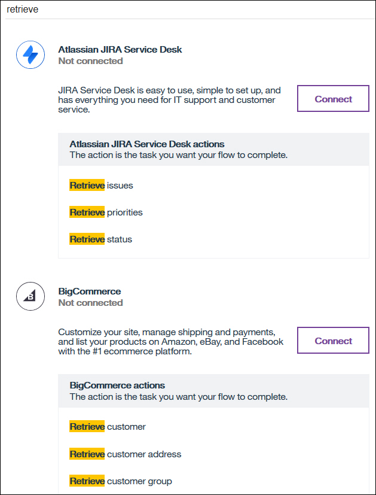
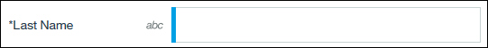
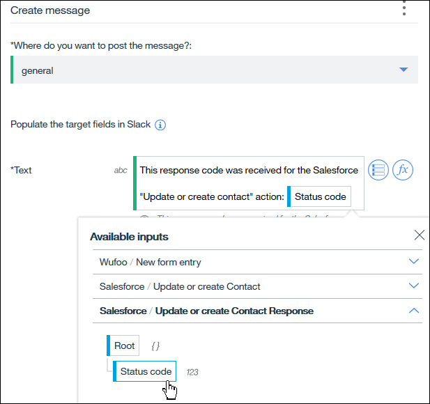

---

copyright:
  years: 2017
lastupdated: "2018-07-20"

---

{:new_window: target="_blank"}
{:shortdesc: .shortdesc}
{:screen: .screen}
{:pre: .pre}
{:table: .aria-labeledby="caption"}
{:codeblock: .codeblock}
{:tip: .tip} 
{:download: .download}

# Concepts d'IBM App Connect
{: #concepts}

{{site.data.keyword.appconservicefull}} est un outil de travail pratique que vous pouvez utiliser pour intégrer vos applications dans le cloud ou sur site afin d'automatiser des tâches routinières et répétitives.

Dans cette section, nous allons expliquer les caractéristiques et la terminologie propres à {{site.data.keyword.appconserviceshort}} :

-   [Flux](#flows)
-   [Applications](#apps)
-   [Actions](#actions)
-   [Mappage des données](#transforms)
-   [Fichiers BAR et serveurs d'intégration](#barfiles)

## Flux
{: #flows}

Vous pouvez créer deux types de flux dans {{site.data.keyword.appconserviceshort}} : les flux événementiels et les flux pour API.

Dans un flux événementiel, vous identifiez un événement qui peut se produire dans votre première application (l'application source) et les actions qui peuvent être effectuées dans une ou plusieurs applications cibles. Le flux relie l'événement aux actions de sorte que, lorsque l'événement se produit dans l'application source, l'action se déclenche automatiquement dans les applications cibles. Chaque action effectuée avec succès compte pour votre quota mensuel. Lorsque vous créez un flux, vous ajoutez vos applications et sélectionnez des actions. Ensuite, vous mappez les données que vous voulez transférer entre vos applications.

Par exemple, vous pouvez créer un flux pour que chaque fois qu'une personne s'inscrit en tant que nouveau participant dans Eventbrite (l'événement), {{site.data.keyword.appconserviceshort}} extrait automatiquement les détails du participant de Salesforce et crée une nouvelle tâche dans Asana (les actions).

Pour plus d'informations, voir [Creating an event-driven flow ](https://developer.ibm.com/integration/docs/app-connect/tutorials-for-ibm-app-connect/creating-event-driven-flow/).

Un flux pour API contient une demande, une ou plusieurs actions d'application cible et une réponse. La demande utilise un modèle que vous définissez pour demander la création, le remplacement ou l'extraction d'objets de données dans vos applications. Lorsque la demande est soumise, chaque application cible effectue son action, puis le flux renvoie une réponse qui confirme que les actions ont réussi ou renvoie les données demandées.

Pour plus d'informations, voir [Creating flows for an API ](https://developer.ibm.com/integration/docs/app-connect/tutorials-for-ibm-app-connect/creating-flows-api/).

En plus d'ajouter des applications à vos flux, vous pouvez également ajouter des noeuds sous l'onglet **Logique** qui vous permettent de configurer le traitement des données. Vous pouvez par exemple utiliser le noeud If pour ajouter un traitement conditionnel (effectuer différentes actions en fonction des données que vous recevez). Voir [Adding conditional logic to a flow ](https://developer.ibm.com/integration/docs/app-connect/tutorials-for-ibm-app-connect/adding-conditional-logic-flow/). D'autre part, vous pouvez utiliser le noeud For each lorsque vous voulez effectuer une action pour chaque enregistrement retourné par une action d'extraction. Voir [Retrieving items from your applications ](https://developer.ibm.com/integration/docs/app-connect/tutorials-for-ibm-app-connect/using-ibm-app-connect-retrieve-items-applications/).

Si vous êtes développeur d'IBM Integration Bus ou App Connect Enterprise, vous pouvez également créer des solutions d'intégration complexes en développant des flux de messages dans Integration Toolkit et en les regroupant en fichiers BAR.

Vos flux et serveurs d'intégration sont représentés sous forme de vignettes sur le tableau de bord d'App Connect. Les vignettes affichent des informations récapitulatives sur le flux, l'API ou le serveur d'intégration, par exemple si un flux est en cours d'exécution ou arrêté, s'il est exécuté avec succès ou s'il a produit une erreur. Vous pouvez cliquer sur les icônes de coche et de point d'exclamation pour voir quand le flux s'est exécuté correctement pour la dernière fois ou passer en revue les erreurs. Cliquez sur les trois points  pour ouvrir un menu qui vous permet de démarrer, arrêter, modifier ou supprimer vos ressources. Les flux doivent être arrêtés avant de pouvoir être édités.

## Applications
{: #apps}

Lorsque vous créez des flux événementiels ou des flux pour API, les _applications_ sont des applications logicielles basées sur le cloud que vous connectez. Vous trouverez une liste des applications que vous pouvez connecter à {{site.data.keyword.appconserviceshort}} sur la page **Applications**. Cliquez sur une application pour obtenir plus d'informations, pour voir quels événements et actions sont pris en charge et pour vous connecter à votre propre compte. Vous pouvez avoir plusieurs comptes connectés à chaque application et passer d'un compte à l'autre sur la page Applications. Après vous être connecté à votre compte, vous pouvez également mettre à jour ou supprimer votre compte sur cette page.

Vous n'avez pas besoin de vous connecter à vos applications sur la page Applications ; vous pouvez également vous connecter dans l'éditeur de flux lorsque vous ajoutez les applications à votre flux. De nombreuses applications ne nécessitent qu'un nom d'utilisateur et un mot de passe, mais certaines nécessitent plus d'informations. Vous trouverez ces informations dans les [guides pratiques des applications ](https://developer.ibm.com/integration/docs/app-connect/how-to-guides-for-apps/).

Si vous utilisez {{site.data.keyword.appconservicefull}} pour exécuter les solutions Integration Bus ou App Connect Enterprise dans le cloud, une _application_ est le conteneur qui contient les flux de messages, bibliothèques et autres ressources requises par votre solution. 

## Actions
{: #actions}

Vous pouvez ajouter plusieurs types d'actions à vos flux. Les actions communes sont la création (create), l'extraction (retrieve), la mise à jour ou création (update or create), mais certaines applications ont des actions spécifiques. Par exemple, l'application Equals 3 Lucy a une action appelée "Ask Lucy", et l'application Watson Personality Insights a une action appelée "Analyze personality". Vous trouverez une liste des actions prises en charge par les applications dans {{site.data.keyword.appconserviceshort}} en tapant le type d'action dans la zone de recherche située en haut de la page Applications :

**Création (create)**

Comme son nom l'indique, l'action create crée un objet ou un enregistrement dans une application. Par exemple, si quelqu'un s'inscrit à votre événement ou soumet un formulaire dûment rempli, vous voudrez peut-être créer un dossier pour cette personne dans votre application de CRM ou de marketing. Ou si quelqu'un ouvre un ticket dans votre application de centre d'assistance, vous pouvez créer un e-mail ou un message instantané pour vous assurer que quelqu'un s'en occupe immédiatement. S'il est possible que l'objet que vous voulez créer existe déjà, vous pouvez utiliser une action *update or create* à la place.

Pour certaines applications, vous devrez peut-être fournir des informations supplémentaires lorsque vous ajoutez une action de création à un flux afin que votre flux sache où créer l'objet. Par exemple, si vous utilisez une application de gestion de projet comme Asana ou Trello, si vous créez une tâche ou une carte, vous devrez spécifier le projet ou le tableau où vous souhaitez l'ajouter.

**Mise à jour ou création (update or create)**

L'action update or create modifie un enregistrement existant dans votre application cible s'il existe, mais crée l'enregistrement s'il n'existe pas déjà. Elle est également connue comme une action upsert (mise à jour ou insertion).

Par exemple, imaginons que quelqu'un a soumis un formulaire Wufoo avec un changement d'adresse. Si le contact est déjà dans votre système CRM, vous voulez mettre à jour son adresse, mais dans le cas contraire, vous voulez l'ajouter. Comme pour l'action d'extraction, lorsque vous choisissez une action pour mettre à jour les données dans l'une de vos applications, vous pouvez ajouter une ou plusieurs conditions pour vous assurer que vous mettez à jour les bonnes informations.

Si plusieurs enregistrements correspondent à vos critères dans votre système cible, une erreur s'affichera sur le tableau de bord pour le flux et le flux ne mettra à jour ou ne créera aucun enregistrement. Par exemple, vous avez peut-être plus d'un contact avec les mêmes prénom et nom de famille. Vous pouvez donc essayer de faire correspondre un contact en utilisant des données uniques, telles que son adresse e-mail.

Les codes d'état que vous êtes susceptible de voir en réponse à une action de mise à jour ou création sont :

-   200 : Un enregistrement a été mis à jour
-   201 : Un enregistrement a été créé

Vous pouvez utiliser ces codes de réponse plus tard dans votre flux. Vous souhaitez peut-être prendre des mesures différentes selon qu'un enregistrement a été mis à jour ou créé. Pour obtenir un exemple de définition d'actions basées sur des codes de réponse, consultez le tutoriel [Creating an event-driven flow that updates or creates a contact in Salesforce and updates Asana whenever you receive a form in Wufoo](https://developer.ibm.com/integration/docs/app-connect/tutorials-for-ibm-app-connect/creating-event-driven-flow-updates-creates-contact-salesforce-updates-asana-whenever-receive-form-wufoo/).

**Extraction (retrieve)**

L'action retrieve récupère les informations d'une application pour que vous puissiez l'utiliser dans une autre application.

Lorsque vous ajoutez une action à votre flux pour extraire des objets, vous pouvez définir une ou plusieurs conditions pour être sûr d'extraire les bons éléments. Si vous souhaitez simplement extraire tous les éléments d'un type particulier, vous pouvez supprimer la condition. Vous pouvez également définir le nombre d'éléments à extraire, et ce qui se passe si {{site.data.keyword.appconserviceshort}} trouve un nombre d'éléments inférieur ou supérieur.

Vous pouvez gérer les éléments extraits de deux manières :

-   Vous pouvez ajouter un noeud "For each" après l'action d'extraction pour effectuer une action pour chacun des éléments extraits.
-   Vous pouvez ajouter une autre action après l'action d'extraction pour traiter la liste des éléments extraits. Il s'agit d'une action unique, quel que soit le nombre d'éléments retournés, comme la création d'un e-mail qui répertorie tous les éléments extraits.

Vous pouvez également décider de l'action à entreprendre en fonction du code d'état que vous obtenez en réponse à l'action d'extraction. Vous pouvez utiliser un noeud "If" pour effectuer différentes actions pour différents codes d'état. Les codes d'état que vous êtes susceptible de voir en réponse à une action d'extraction sont :

-   204 : Aucun enregistrement n'a été trouvé
-   200 : Tous les enregistrements de l'application correspondent à la condition
-   206 : Le nombre maximum d'enregistrements spécifié a été extrait, mais d'autres enregistrements correspondent dans l'application

Pour plus d'informations, voir [Retrieving items from your applications](https://developer.ibm.com/integration/docs/app-connect/tutorials-for-ibm-app-connect/using-ibm-app-connect-retrieve-items-applications/).

## Mappage des données
{: #transforms}

Lorsque vous avez créé un flux, ajouté vos applications et sélectionné les actions appropriées, vous devez spécifier les informations à transférer entre vos applications. Dans l'éditeur de flux, lorsque vous ajoutez une action à votre flux, vous verrez une liste des zones disponibles pour cette application, que vous pouvez remplir avec les données de votre application source, ou des actions précédentes dans le flux.

Certaines zones sont obligatoires et sont marquées d'un astérisque. Par exemple, lorsque vous créez un client potentiel dans Salesforce, vous devez spécifier un nom de famille :

Si vous cliquez sur l'une de ces zones, vous verrez s'afficher deux icônes : **Insérer une référence** et **Appliquer une fonction**. Si vous cliquez sur **Insérer une référence**, vous verrez les données disponibles que vous pouvez mettre dans cette zone, provenant des applications précédentes dans le flux. L'exemple suivant montre que nous pouvons choisir des zones venant de l'application source de Wufoo ou d'une action précédente de Salesforce dans le flux. Nous pouvons également utiliser le code d'état de l'action update or create de Salesforce.

Dans l'exemple suivant, notre flux est déclenché par la réception d'un nouveau formulaire complété dans Wufoo. Nous voulons créer un contact dans Salesforce pour la personne qui a soumis le formulaire. Ainsi, lorsque nous ajoutons au flux notre action "Créer un contact" dans Salesforce, nous copions les détails de notre contact du formulaire Wufoo. Ici nous pouvons voir que pour le nom du contact dans Salesforce, nous avons sélectionné le nom de l'auteur du formulaire dans Wufoo. On reconnaît à la couleur que la zone mappée provient de Wufoo :

Dans l'exemple suivant, nous avons ajouté au flux une action "Créer un message" dans Slack après une action "Mettre à jour ou créer un contact" dans Salesforce. Nous voulons simplement créer un message sur Slack pour dire quel code de réponse a été reçu pour l'action de Salesforce : 

Vous pouvez voir que dans la zone **Texte** de l'action Slack "Créer un message", nous avons tapé un message, puis mappé le code d'état de l'action "Mettre à jour ou créer un contact" de Salesforce.

Prenons un autre exemple pour montrer une façon différente de mapper des codes de réponse. Cette fois, nous avons ajouté un noeud "If" après une action "Mettre à jour ou créer un contact" de Salesforce parce que nous voulons effectuer des actions différentes selon qu'un contact Salesforce existant a été mis à jour ou qu'un nouveau contact a été créé. Dans ce cas, un code de réponse "200" signifie que le contact a été mis à jour. Cette branche du noeud "If" contiendra donc une action spécifique à un enregistrement mis à jour.

L'icône **Appliquer une fonction**  vous montre une liste des fonctions de transformation que vous pouvez utiliser pour personnaliser les données que vous transmettez par votre flux. Ces fonctions peuvent être aussi simples que la conversion d'une zone spécifique en majuscules ou minuscules, ou légèrement plus complexes, comme la recherche et le remplacement de modèles spécifiques dans les données. Elles peuvent également être suffisamment puissantes pour former des expressions régulières. Vous pouvez soit sélectionner la fonction souhaitée dans la liste, soit la saisir vous-même. La syntaxe des fonctions est JSONata, un langage de requête et de transformation simple. Pour plus d'informations, voir [http://jsonata.org](http://jsonata.org).

## Fichiers BAR et serveurs d'intégration
{: #barfiles}

Un fichier BAR est un fichier compressé auquel vous ajoutez des ressources déployables dans IBM Integration Bus ou App Connect Enterprise. Lorsque vous développez une solution d'intégration dans Integration Bus ou App Connect Enterprise, vous regroupez vos flux de messages et toutes les ressources qu'ils utilisent dans un fichier BAR, puis déployez le fichier BAR sur un serveur d'intégration. Ce serveur peut être sur site ou dans {{site.data.keyword.appconserviceshort}}. Vous pouvez exécuter vos solutions Integration Bus ou App Connect Enterprise dans App Connect, sans avoir à acquérir et à maintenir une infrastructure informatique. Lorsque vous téléchargez un fichier BAR vers App Connect, un serveur d'intégration est créé pour exécuter le contenu du fichier BAR. Vous pouvez configurer l'authentification de base et la connectivité sécurisée entre vos ressources dans le cloud et sur site (voir [Running your Integration Bus solutions in App Connect ](https://developer.ibm.com/integration/docs/app-connect/tutorials-for-ibm-app-connect/running-your-ibm-integration-bus-solutions-in-ibm-app-connect-enterprise-beta-plan)).  
