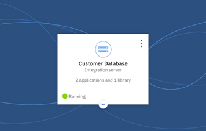
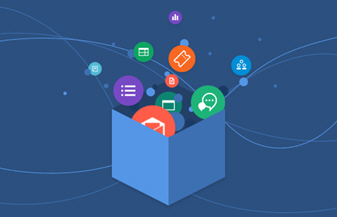

---

copyright:
  years: 2017
lastupdated: "2018-07-19"

---

{:new_window: target="_blank"}
{:shortdesc: .shortdesc}
{:screen: .screen}
{:pre: .pre}
{:codeblock: .codeblock}
{:tip: .tip} 
{:download: .download}

# IBM App Connect
{: #appconnect}

{{site.data.keyword.appconservicefull}} は、毎日使用するアプリケーションを接続し、退屈な作業を自動化する統合ソリューションです。

{{site.data.keyword.appconserviceshort}} は、アプリケーションを数分で接続して、更新、通知、イベントを自動化し、複数のアプリケーション間でデータを同期させておきます。これを使用して、クラウド内アプリケーションまたはローカル (オンプレミス) アプリケーションを接続できます。  

アプリを接続するために {{site.data.keyword.appconserviceshort}} で実行できるリソースには、ビジネス・ニーズによって統合サーバーとフローの 2 つのタイプがあります。  

{{site.data.keyword.appconserviceshort}} で IBM Integration Bus または App Connect Enterprise ソリューションを実行するには、BAR ファイル内の統合ソリューションをアップロードした後、{{site.data.keyword.appconserviceshort}} 内の統合サーバーで実行します。

アプリケーションを接続するためのフローを {{site.data.keyword.appconserviceshort}} で作成することにより、あるアプリケーションであることが発生すると別のアプリケーションでほかのことが発生するようにすることができます。アプリケーション間でデータを単一のバッチ・コピーとしてまたは継続的な同期でルーティングするフローを作成します。

イベント・ドリブン・フローと API 用のフローを作成できます。

名前が示すように、イベント・ドリブン・フローの作成を開始するには、1 つのイベントを選択します。このイベントは、フローの機能を開始するための最初のアプリケーション内のトリガーです。次に、アクションを選択します。このアクションは、別のアプリケーションでフローに実行させるタスクです。 

{{site.data.keyword.appconserviceshort}} ダッシュボードを使用することにより、フローと統合サーバーをモニターしてどの程度有効に機能しているかを調べることができます。それらを開始、停止し、必要なときは変更します。

ただそれだけのことです。アプリケーションの接続を始めて、{{site.data.keyword.appconserviceshort}} を有効に活用してください。

