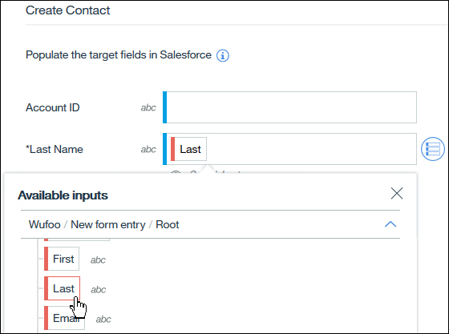

---

copyright:
  years: 2017, 2019
lastupdated: "2019-02-20"

---

{:new_window: target="_blank"}
{:shortdesc: .shortdesc}
{:screen: .screen}
{:pre: .pre}
{:table: .aria-labeledby="caption"}
{:codeblock: .codeblock}
{:tip: .tip} 
{:download: .download}

# IBM App Connect 概念
{: #concepts}

{{site.data.keyword.appconservicefull}} 是一種可讓企業輕鬆使用的工具，可用來整合雲端型或內部部署應用程式以自動執行繁瑣且重複的作業。

{{site.data.keyword.appconserviceshort}} 能快速連接您的應用程式 - 自動化更新、通知和事件，並保持多個應用程式之間的資料同步。您可以使用它來連接雲端中的應用程式或本端（內部部署）應用程式。  

視您的商業需要而定，您可以在 {{site.data.keyword.appconserviceshort}} 中執行兩種類型的資源來連接應用程式：整合伺服器和流程。若要執行 IBM Integration Bus 或 App Connect Enterprise 解決方案，您可以使用 BAR 檔案上傳整合解決方案，然後在 {{site.data.keyword.appconserviceshort}} 的整合伺服器中執行它。您可以在 {{site.data.keyword.appconserviceshort}} 中建立流程來連接應用程式，以便在某個應用程式中發生的事，會導致在另一個應用程式中發生其他事。您可以建立事件驅動流程及 API 的流程。   

您可以使用 {{site.data.keyword.appconserviceshort}} 儀表板來監視流程及整合伺服器，以查看它們為您執行多少工作。啟動並停止它們，並視需要進行變更。

我們在這裡詳細說明 {{site.data.keyword.appconserviceshort}} 的特性和術語：

-   [流程](#flows)
-   [應用程式](#apps)
-   [動作](#actions)
-   [資料對映](#transforms)
-   [BAR 檔案及整合伺服器](#barfiles)

## 流程
{: #flows}

在 {{site.data.keyword.appconserviceshort}} 中可建立兩種流程類型：事件驅動流程和 API 的流程。

在事件驅動流程中，您可以識別在第一個應用程式（來源應用程式）中發生的事件，以及可在一個以上目標應用程式中執行的動作。流程會將事件鏈結至動作，以便只要在來源應用程式發生事件，即會在目標應用程式中自動觸發動作。每個順利完成的動作都會計入每月配額中。當您建立流程時，您會新增應用程式，並選擇動作。然後，您會對映要在應用程式之間傳送的資料。

例如，您可能會建立流程，以便只要有人向 Eventbrite 登錄為新的與會者（事件），{{site.data.keyword.appconserviceshort}} 就會自動從 Salesforce 擷取與會者的詳細資料，並在 Asana 中建立新的作業（動作）。

如需相關資訊，請參閱[建立事件驅動流程 ](https://developer.ibm.com/integration/docs/app-connect/tutorials-for-ibm-app-connect/creating-event-driven-flow/)。

API 的流程包含一個要求、一個以上的目標應用程式動作，以及一個回應。要求會使用您定義的模型來要求建立、取代或擷取應用程式中的資料物件。提交要求時，每個目標應用程式都會執行其動作。流程接著會傳回確認動作成功的回應，或傳回所要求的資料。

如需相關資訊，請參閱 [Creating flows for an API ](https://developer.ibm.com/integration/docs/app-connect/tutorials-for-ibm-app-connect/creating-flows-api/)。

不但可以將應用程式新增至流程，您還可以從**邏輯**標籤新增節點，以配置資料處理方式。例如，使用 If 節點以新增一些條件式處理 - 根據收到的資料來執行不同動作（請參閱 [Adding conditional logic to a flow ](https://developer.ibm.com/integration/docs/app-connect/tutorials-for-ibm-app-connect/adding-conditional-logic-flow/)）。而且，當您要對擷取動作所傳回的每筆記錄執行動作時，請使用 **For each** 節點（請參閱 [Retrieving items from your applications ](https://developer.ibm.com/integration/docs/app-connect/tutorials-for-ibm-app-connect/using-ibm-app-connect-retrieve-items-applications/)）。

如果您是 IBM Integration Bus 或 App Connect Enterprise 開發人員，則也可以在 Integration Toolkit 中開發訊息流程並將它們包裝成 BAR 檔案，以建立複雜的整合解決方案。

在 App Connect 儀表板上，您的流程及整合伺服器會以磚呈現。這些磚顯示流程、API 或整合伺服器的摘要資訊，例如流程正在執行還是已停止，以及它是否產生錯誤。您可以按一下刻度及驚嘆號圖示，以查看流程前次順利執行的時間或觸發的錯誤。按一下三個點  以開啟功能表，來啟動、停止、編輯或刪除資源。必須先停止流程，您才能對其進行編輯。

## 應用程式
{: #apps}

建立事件驅動流程或 API 的流程時，_應用程式_ 就是您所連接的雲端型軟體應用程式。您可以在**應用程式**頁面上看到可使用 {{site.data.keyword.appconserviceshort}} 進行連線的應用程式清單。按一下應用程式以找出其相關資訊、查看支援的事件及動作，以及連接至您自己的帳戶。您可以將多個帳戶連接至每個應用程式，並在「應用程式」頁面上進行切換。連接至您的帳戶之後，您也可以在「應用程式」頁面上更新或移除帳戶。

您不需要在「應用程式」頁面上連接至應用程式；您也可以在將應用程式新增至流程時，在流程編輯器中進行連接。許多應用程式只需要使用者名稱及密碼，但有些則需要更多資訊。您可以在 [How-to guides for apps ](https://developer.ibm.com/integration/docs/app-connect/how-to-guides-for-apps/) 瞭解如何找到此資訊。

如果您使用 {{site.data.keyword.appconservicefull}} 在雲端中執行 Integration Bus 或 App Connect Enterprise 解決方案，_應用程式_ 就是保留您訊息流程、程式庫以及解決方案所需之其他資源的容器。 

## 動作
{: #actions}

您可以將數種類型的動作新增至流程。一般動作是建立、擷取以及更新或建立，但部分應用程式具有特定動作。例如，Watson Personality Insights 應用程式有一個稱為「分析個性」的動作。在「應用程式」頁面上的搜尋欄位中鍵入動作類型，即可看到 {{site.data.keyword.appconserviceshort}} 中應用程式所支援的動作清單：

**建立**

顧名思義，建立動作會在應用程式中建立物件或記錄。例如，如果有人註冊事件或提交已完成的表單，則建議您在 CRM 或行銷應用程式中建立該人員的記錄。或者，如果有人在您的服務台應用程式中開立問題單，則建議您建立電子郵件或即時訊息，確定有人可立即處理它。如果您要建立的物件可能已存在，則您可以改為使用*更新或建立* 動作。

在部分應用程式中，當您將建立動作新增至流程以讓流程知道在何處建立物件時，可能需要提供一些額外資訊。例如，如果您使用專案管理應用程式（如 Asana 或 Trello），則在建立作業或卡片時，需要指定專案或您要新增它的板。

**更新或建立**

更新或建立動作會變更現有目標應用程式中已存在的現有記錄，但會建立尚未存在的記錄。它也稱為更新插入（更新或插入）動作。

例如，假設有人提交地址變更的 Wufoo 表單。如果聯絡人已在 CRM 系統中，則您可以更新其地址；但如果不存在，則可以予以新增。與擷取動作相似，當您選擇動作來更新其中一個應用程式的資料時，可以新增一個以上的條件，以確定您正在更新正確的資訊。

如果目標系統中有多筆記錄符合您的準則，您會在儀表板上看到流程錯誤，而且流程不會更新或建立任何記錄。例如，您可能有多位名字及姓氏相同的聯絡人。因此，您可以嘗試使用唯一資料（例如其電子郵件位址）來比對聯絡人。

您可能會在回應更新或建立動作時，看到下列狀態碼：
-   200 已更新記錄
-   201 已建立記錄

您稍後可以在流程中使用這些回應碼。建議您根據是更新還是建立記錄，來採取不同的動作。如需根據回應碼定義動作的範例，請參閱 [Creating an event-driven flow that updates or creates a contact in Salesforce and updates Asana whenever you receive a form in Wufoo ](https://developer.ibm.com/integration/docs/app-connect/tutorials-for-ibm-app-connect/creating-event-driven-flow-updates-creates-contact-salesforce-updates-asana-whenever-receive-form-wufoo/) 指導教學。

**擷取**

擷取動作會從應用程式取得資訊，以便您可以將它用於另一個應用程式。

當您將動作新增至流程來擷取物件時，可以定義一個以上的條件，以確定您將擷取正確的項目。或者，如果您要擷取特定類型的所有項目，則可以刪除條件。您也可以定義要擷取多少個項目，以及 {{site.data.keyword.appconserviceshort}} 發現超過或小於該數目時會發生什麼情況。

您可以使用兩種方式來處理擷取項目：
-   您可以在擷取動作後面新增一個 For each 節點，以對每個已擷取的項目執行動作。
-   您可以在擷取動作後面新增另一個動作，以處理已擷取項目的清單。不論傳回多少個項目，這都是單一動作，例如，建立列出所有已擷取項目的電子郵件。

您也可以根據您取得以回應擷取動作的狀態碼，來決定要採取的動作。您可以使用 "If" 節點，對不同的狀態碼執行不同的動作。您可能會在回應擷取動作時，看到下列狀態碼：
-   204 找不到任何記錄
-   200 應用程式中的所有記錄都符合條件
-   206 已擷取指定的最大記錄數目，但應用程式中還有其他相符記錄

如需相關資訊，請參閱 [Retrieving items from your applications ](https://developer.ibm.com/integration/docs/app-connect/tutorials-for-ibm-app-connect/using-ibm-app-connect-retrieve-items-applications/)。

## 資料對映
{: #transforms}

建立流程、新增應用程式以及選取適當的動作之後，您必須指定要在應用程式之間傳送的資訊。在流程編輯器中，當您將動作新增至流程時，將會看到該應用程式的可用欄位清單。您可以在這些欄位中移入來源應用程式中的資料，或流程中的先前動作。

部分欄位是必要欄位，並且會標上星號。例如，當您在 Salesforce 中建立領導人時，必須指定姓氏：

當您按一下其中一個欄位時，會看到許多圖示：**插入參照**  和**套用函數** 。如果您按一下**插入參照**，則會看到可放入流程之先前應用程式中該欄位的可用資料。下列範例顯示我們可以從 Wufoo 來源應用程式或流程的先前 Salesforce 動作中選擇欄位。我們也可以使用來自 Salesforce 更新或建立動作的狀態碼。

在下列範例中，在 Wufoo 中收到新的已完成表單時會觸發流程。我們想要在 Salesforce 中針對提交表單的人員建立聯絡人。因此，我們將 Salesforce「建立聯絡人」動作新增至流程時，會從 Wufoo 表單複製聯絡人的詳細資料。在這裡，可以看到針對 Salesforce 聯絡人的姓氏，我們選取了 Wufoo 表單提交者的姓氏。您可以透過顏色看到已對映的欄位來自 Wufoo：

在下列範例中，我們在 Salesforce「更新或建立聯絡人」動作後面，將 Slack「建立訊息」動作新增至流程。我們想要在 Slack 上放置訊息，以指出針對 Salesforce 動作所收到的回應碼：

您可以看到，在 Slack「建立訊息」動作的**文字**欄位中，我們鍵入一則訊息，然後在 Salesforce「更新或建立聯絡人」動作的狀態碼中進行對映。

以下是使用不同方式對映回應碼的另一個範例。這次，我們在 Salesforce「更新或建立聯絡人」動作後面新增 "If" 節點，因為要根據是更新現有 Salesforce 聯絡人還是建立新聯絡人來執行不同動作。在此情況下，回應碼 200 表示已更新聯絡人。因此，If 節點的這個分支會包含已更新記錄特有的動作。

**套用函數**圖示  顯示可用來自訂要通過流程之資料的轉換函數清單。這些函數簡單者可以像是將特定欄位轉換為大寫或小寫文字，或是稍為複雜一點的尋找及取代資料中的特定型樣。它們也可以功能強大到比如形成正規表示式。您可以從清單中選取您要的函數，也可以自行鍵入。函數的語法是 JSONata，這是一種輕量型查詢及轉換語言。如需相關資訊，請參閱 [http://jsonata.org ](http://jsonata.org)。

## BAR 檔案及整合伺服器
{: #barfiles}

BAR 檔案是 IBM Integration Bus 或 App Connect Enterprise 中要新增可部署資源的壓縮檔。當您在 Integration Bus 或 App Connect Enterprise 中開發整合解決方案時，可以將訊息流程和這些訊息流程使用的所有資源都包裝為 BAR 檔案。然後，可以將 BAR 檔案部署至整合伺服器。該伺服器可以在內部部署或在 {{site.data.keyword.appconserviceshort}} 中。您可以在 App Connect 中執行 Integration Bus 或 App Connect Enterprise 解決方案，而不需要獲得及維護 IT 基礎架構。當您將 BAR 檔案上傳至 App Connect 時，會建立整合伺服器以執行 BAR 檔案的內容。您可以配置雲端型與內部部署資源之間的基本鑑別及安全連線（請參閱 [Running your Integration Bus solutions in App Connect ](https://developer.ibm.com/integration/docs/app-connect/tutorials-for-ibm-app-connect/running-your-ibm-integration-bus-solutions-in-ibm-app-connect-enterprise-beta-plan)）。  
